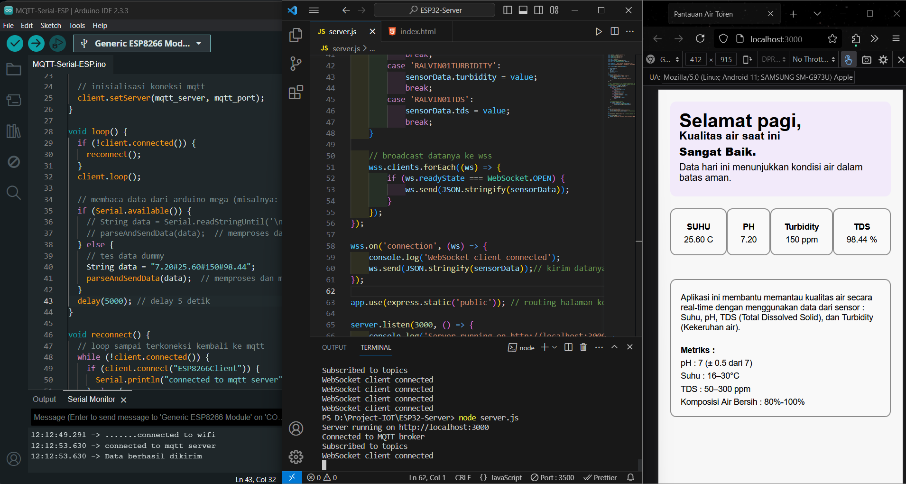
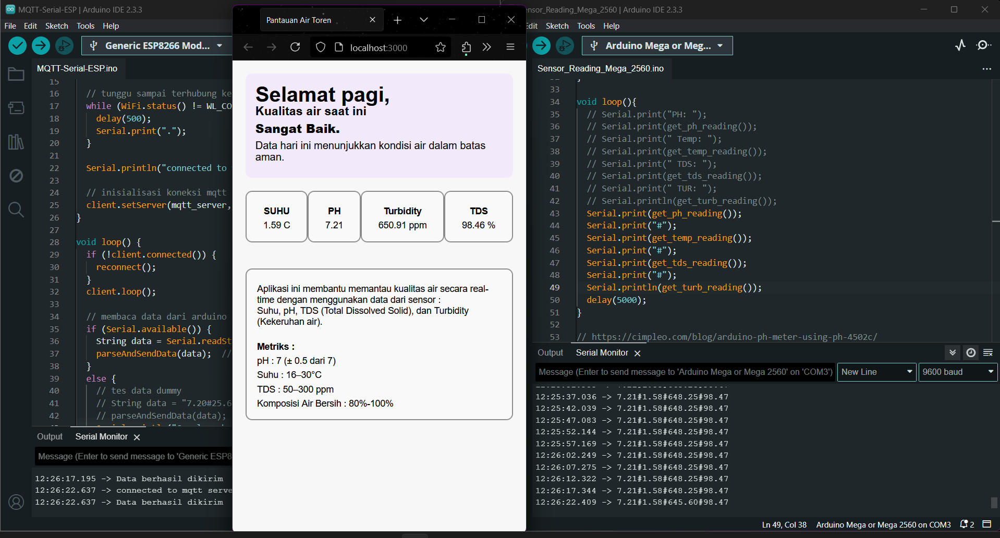

# Proyek IOT - Pemantauan Kualitas Air
## Hardware Requirement
Proyek ini membutuhkan beberapa perangkat arduino sebagai berikut :
- [ ] Arduino Mega 2560 / Equivalent
- [ ] NodeMCU ESP8266
- [ ] Level shifter 5v -> 3.3v (Optional)
- [ ] Breadboard
- [ ] [**DS18B20 Arduino Temperature sensor**](https://wiki.dfrobot.com/Waterproof_DS18B20_Digital_Temperature_Sensor__SKU_DFR0198_) 
- [ ] [**gravity arduino turbidity sensor**](https://wiki.dfrobot.com/Turbidity_sensor_SKU__SEN0189) 
- [ ] [PH-4502C Sensor](https://raaflahar.medium.com/ph-4502c-sensor-diymore-how-to-use-and-calibrate-using-arduino-uno-r3-3afc2b96631) 
- [ ] [Arduino Analog TDS Sensor](https://wiki.dfrobot.com/Gravity__Analog_TDS_Sensor___Meter_For_Arduino_SKU__SEN0244) 
- [ ] Pull-up resistor 4k7 untuk sensor DS18B20

## Hasil Testing
### Tampilan UI Awal
Pada tahap berikut belum ada implementasi logging / pemilihan profil (scale up)



### Tampilan UI Final
Tahap yang terbaru sudah memiliki laman untuk memilih device / toren yang ingin dipantau.
Selain itu, sudah ada logging dan analisis sederhana yang disimpulkan dari data keempat sensor

- Halaman pemilihan profil / device

- Halaman dashboard saat data dari broker masih kosong


## Menjalankan Aplikasi
# Instruksi untuk Menjalankan Kode

## Prasyarat dan Koneksi Perangkat

1. **Install Node.js**  
2. **Install Arduino IDE**  
3. **Tambahkan Additional Board Manager di Arduino IDE**  
   - Masukkan URL berikut ke dalam Board Manager:  
     ```
     http://arduino.esp8266.com/stable/package_esp8266com_index.json
     https://dl.espressif.com/dl/package_esp32_index.json
     ```
4. **Install Library pada Arduino IDE**  
   - ESP8266WiFi  
   - PubSubClient  
   - DallasTemperature  
   - OneWire  
   - GravityTDS  
5. **Pasang TX pada Arduino dan RX pada ESP8266**  
   - Koneksi ini diperlukan untuk menerima data serial dari Arduino Mega ke ESP8266 agar data dapat dikirim ke MQTT Broker.

## Menjalankan Aplikasi

1. **Clone Repository**  
2. **Install Dependency**  
- Jalankan `npm install` (abaikan jika sudah).  
3. **Jalankan Webserver**  
- Jalankan perintah:  
  ```
  npm run start
  ```
